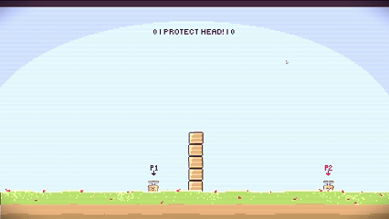

# Jump N’ Stomp

**2-Spieler-Game · Godot · GDScript**

Jump N’ Stomp ist ein kompetitives 2-Spieler-Game, bei dem zwei Spieler versuchen, sich gegenseitig durch gezielte Sprünge und Stomps zu besiegen.

Das Projekt entstand im Rahmen des Studiums **Audiovisuelle Medien** an der Hochschule der Medien Stuttgart.

## Gameplay

Der zentrale Gameplay-Mechanismus ist das Stompen des gegnerischen Spielers. Wird ein Spieler getroffen, greifen verschiedene Gameplay-Systeme für Tod, Respawn, Punkte und Schutzmechaniken ineinander.

Zu den umgesetzten Elementen gehören unter anderem:

- 2-Spieler-Gameplay
- Stomp-Mechanik
- Death- und Respawn-System
- Out-of-Bounds-Erkennung
- Stomp-Cooldown
- Invincibility-/Schutzmechanik
- Punkte- und Siegbedingungen
- Game-Over-System
- visuelles Gameplay-Feedback durch Shader und Partikeleffekte

## Mein Beitrag

Mein Schwerpunkt lag auf der **Fehleranalyse, dem Debugging und der technischen Weiterentwicklung des Gameplays**.

Da sich während der Entwicklung verschiedene Systeme als fehleranfällig erwiesen, habe ich bestehende Implementierungen untersucht, angepasst und miteinander integriert, bis sie zuverlässig im Spiel funktioniert haben.

### Debugging & Gameplay Programming

- Analyse und Behebung von Fehlern in bestehenden Gameplay-Systemen
- Anpassung und Integration von Game Mechanics
- Debugging der State Machine und ihrer Zustände
- Fehlerbehebung beim Death- und Respawn-Verhalten
- Debugging der Spawn- und Out-of-Bounds-Logik
- Anpassung des Score- und Game-Over-Systems
- Abstimmung verschiedener Gameplay-Systeme untereinander
- Testen und Nachvollziehen von Fehlern direkt im laufenden Spiel

### Technische Weiterentwicklung

Neben dem Debugging habe ich bestehende Systeme weiter angepasst und funktional erweitert.

Dazu gehörten unter anderem:

- Respawn-Verzögerungen und Respawn-Abläufe
- Signale für Ereignisse wie `stomped` und `out_of_bounds`
- Stomp-Cooldown und dessen visuelle Darstellung
- Shader-basierte Fortschrittsanzeige
- Invincibility-/Duck-Shader
- Partikel- und Dust-Effekte
- Scoreboard und Siegbedingungen

Ein besonderer Fokus lag darauf, dass die einzelnen Systeme nicht nur isoliert funktionieren, sondern **im tatsächlichen Gameplay zuverlässig zusammenspielen**.

## Versionskontrolle

Die Entwicklung erfolgte mit **Git**. Dabei habe ich mit Branches gearbeitet, Änderungen nachvollzogen und verschiedene Entwicklungsstände wiederhergestellt bzw. zusammengeführt.

## Technologien

- **Godot**
- **GDScript**
- **Git / GitHub**
- Shader
- Partikelsysteme

## Projektkontext

**Projektart:** Hochschulprojekt  
**Genre:** 2-Spieler-Competitive Game  
**Engine:** Godot  
**Rolle:** Gameplay Programming / Debugging / technische Weiterentwicklung