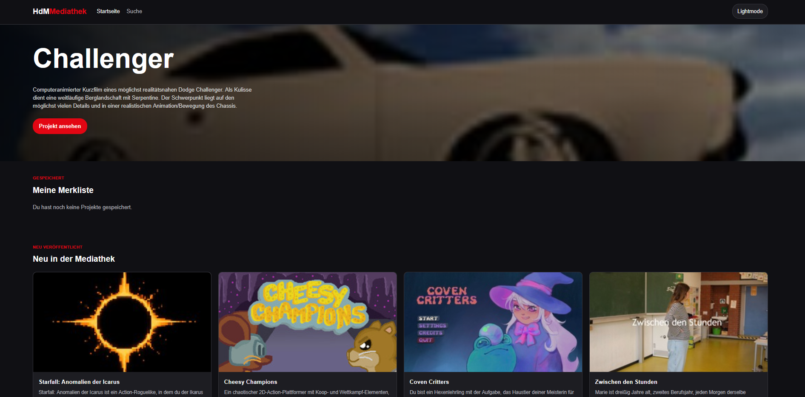

# HdM-Mediathek

**Webanwendung · HTML · CSS · JavaScript · REST-API**

Eine webbasierte Umsetzung einer Mediathek-Oberfläche der Hochschule der Medien.
Projekte werden dynamisch über eine REST-API geladen und auf verschiedenen Seiten dargestellt.

## Funktionen

- Projektübersicht mit allen verfügbaren Mediathek-Projekten
- Dynamische Projektdarstellung über eine REST-API
- Zufälliges Projekt auf der Startseite
- Detailseiten für einzelne Projekte
- Navigation über URL-Parameter (projekt_ID)
- Darstellung von Projektinformationen und Mediainhalten
- Anzeige des jeweiligen Studienbereichs
- Responsive Gestaltung für Desktop und Mobile

## Mein Beitrag

Ich habe die Anwendung mit HTML, CSS und JavaScript umgesetzt.

Dabei lag der Schwerpunkt auf der Verbindung der Benutzeroberfläche mit der REST-API und der dynamischen Darstellung der Projektdaten.

### Technische Umsetzung

- Abrufen und Verarbeiten von Daten über eine REST-API
- Dynamisches Erzeugen von Projektinhalten mit JavaScript
- Navigation zu einzelnen Projekten über URL-Parameter
- Responsive Layoutgestaltung mit CSS
- Umsetzung einer mobilen Darstellung
- Integration von Video- und Mediainhalten

## Technologien

- **HTML**
- **CSS**
- **JavaScript**
- **REST-API**

## Projektkontext

**Projektart:** Hochschulprojekt  
**Bereich:** Webentwicklung / Interaktive Medien## Zusatzfeature: Merkliste

Persönliche Merkliste. Projekte können auf der Detailseite gespeichert oder wieder entfernt werden. Die gespeicherten Projekt-IDs werden mit `localStorage` im Browser gesichert und auf der Startseite in einem eigenen Bereich angezeigt. Dadurch bleibt die Merkliste auch nach dem Neuladen der Seite erhalten
